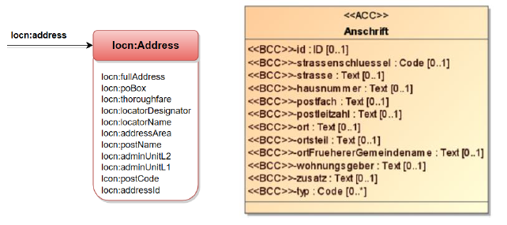

# Konventionen zum `dcat:Dataset`

## Kontakt (`dcat:contactPoint`) {#ansprechstelle}

Daten zu Kontaktmöglichkeiten eines Datensatzes bzw. eines Katalogs können mit dem vCard-Vokabular angegeben werden. Die folgende Untermenge der in vcard möglichen Typen wird besonders empfohlen:

| vcard - Vokabular    |                                                        |
| :------------------- | :----------------------------------------------------- |
| `vcard:fn`           | Name                                                   |
| `vcard:hasEmail`     | E-Mailadresse                                          |
| `vcard:hasTelephone` | Telefonnummer                                          |
| `vcard:hasURL`       | Link zum Kontaktformular (empfohlen) oder zur Webseite |

<figure id="konvention-01" class="konvention"><figcaption>
Kontaktinformationen MÜSSEN mindestens Angaben zur Email (`vcard:hasEmail`) oder einen Link zum Kontaktformular oder Chatbot (`vcard:hasURL`) enthalten.
</figcaption></figure>


## Webseite mit Beschreibung des Qualitätssicherungsprozesses (`dcatde:qualityProcessURI`) {#webseite-mit-beschreibung-des-qualitatssicherungsprozesses}

DCAT-AP.de hat DCAT-AP um das Feld `dcatde:qualityProcessURI` erweitert, um auf generelle Informationen über einen Qualitätssicherungsprozess verweisen zu können. Deutsche Datenkataloge des GovData Portalverbundes beschreiben teilweise bereits die Mindestqualitätskriterien, die ein Datensatz erfüllen muss, um in das Datenportal aufgenommen zu werden.

<figure id="konvention-02" class="konvention"><figcaption>
Sind Informationen im Web zu Qualitätssicherungsprozessen eines Datensatzes oder Datenservices vorhanden, so KÖNNEN diese über das Feld `dcatde:qualityProcessURI` transportiert werden.
</figcaption></figure>


## Sprachangabe bei mehrsprachigen Angaben

<figure id="konvention-03" class="konvention"><figcaption>
Beschreibungsfelder (z.B. `dct:title`, `dct:description`) KÖNNEN bei Vorhandensein von Metadaten in mehreren Sprachen wiederholt auftreten. Ist die Sprache nicht Deutsch, so MUSS sie mit den Sprachcodes gemäß BCP473 ausgezeichnet werden. Gibt es für eine Sprache keinen Alpha-2 Code nach ISO 639-1, so ist der Alpha-3 Code nach ISO 639-2 zu verwenden.
</figcaption></figure>

<aside class="example html" data-format="text" title="Sprachangabe bei mehrsprachigen Angaben">

```
RDF/XML:
&lt;dct:title xml:lang="de">EU Budgetdaten&lt;/dct:title&gt;
&lt;dct:title xml:lang="en">EU Budget Data&lt;/dct:title&gt;

Turtle:
_:ds dct:title "EU Budgetdaten"@de , 
               "EU Budget Data"@en .
```

</aside>

## Angaben zur geografischen Abdeckung (`dct:spatial`) {#angaben-zur-geografischen-abdeckung}

Die Angabe zum geografischen oder geometrischen Bezug eines Datensatzes kann in DCAT-AP.de zusätzlich zu `dct:spatial`  durch die Verwendung der folgenden Eigenschaften erfolgen:
- `dcatde:politicalGeocodingURI` – administrativer Geobezug als URI,
- `dcatde:politicalGeocodingLevelURI` – Ebene des administrativen Geobezugs als URI,
- `dcatde:geocodingDescription` – verwaltungspolitischer oder fachlicher Geobezug als beschreibender Text.


### Geometrische Ortsbezüge (`dct:spatial` mit `locn:geometry`)

`dct:spatial` kann sowohl geometrische Ortsbezüge, als auch geografische Ortsbezüge per URI und strukturierte Adressanschriften aufnehmen. Da dies von INSPIRE gefordert wird, liegt der Ortsbezug meist in Form einer Geometrie (z.B. einer Bounding Box) vor.

<aside class="ednote">
Eine Überarbeitung und Eingrenzung des empfohlenen Vorgehens erfolgt in der nächsten Version, wenn die dafür benötigten EU-Best-Practices für die neuen Eigenschaften `dcat:bbox` und `dcat:centroid` vorliegen.
</aside>

Beispiel zur Angabe eines Punktes mit Koordinatensystem CRS84 mit locn:geometry:

|                |                                                                              |
| :------------- | :--------------------------------------------------------------------------- |
| __Name__       | locn:geometry                                                                |
| __URI__        | http://www.w3.org/ns/locn#geometry                                           |
| __Range__      | http://www.w3.org/ns/locn#Geometry                                           |
| __Definition__ | Verbindet einen Datensatz mit seiner entsprechenden geometrischen Abdeckung. |

__Verwendungshinweise__

Zur Wahrung von Interoperabilität SOLLTEN folgende Typen verwendet werden: 
- für jede Geometrie:
  - WKT, GML, und RDF+WKT/GML, entsprechend der [GeoSPARQL Spezifikation](http://www.opengeospatial.org/standards/geosparql),
  - KML ([Keyhole Markup Language](http://www.opengeospatial.org/standards/kml)), (Hinweis: KML unterstützt nur die folgenden Geometrien: „point“, „line string“, „linear ring“ und „polygon“.)
  - RDF wie in [schema.org](https://schema.org/) Vokabularklassen [schema:GeoCoordinates](https://schema.org/GeoCoordinates) und [schema:GeoShape](https://schema.org/GeoShape).
- für Punkte: Eine der oben genannten Varianten oder: 
  - RDF gemäß W3C Basic Geo (WGS84 lat/long) vocabulary, 
  - [GeoHash URIs](http://geohash.org/),
  - [geo URIs](https://tools.ietf.org/rfc/rfc5870).


<aside class="example html" data-format="text" title="verschiedene Codierungen identischer Geodaten">

```
gsp: &lt;http://www.opengis.net/ont/geosparql#&gt;
sf:  &lt;http://www.opengis.net/ont/sf#&gt;

WKT (GeoSPARQL)
:aLocation locn:geometry 
  "Point(-0.001475 51.477811)"^^gsp:wktLiteral .

GML
:aLocation locn:geometry
  "&lt;gml:Point srsName='http://www.opengis.net/def/crs/OGC/1.3/CRS84'&gt;&lt;gml:coordinates&gt;-0.001475, 51.477811&lt;/gml:coordinates&gt;&lt;/gml:Point&gt;"^^gsp:gmlLiteral .

RDF+WKT (GeoSPARQL)
:aLocation locn:geometry [
  a sf:Point; 
  gsp:asWKT "Point(-0.001475 51.477811)"^^gsp:wktLiteral
] .

RDF+GML (GeoSPARQL)
:aLocation locn:geometry [
  a sf:Point; 
  gsp:asGML "&lt;gml:Point srsName= 'http://www.opengis.net/def/crs/OGC/1.3/CRS84'&gt;&lt;gml:coordinates&gt;-0.001475,51.477811&lt;/gml:coordinates&gt;&lt;/gml:Point&gt;"^^gsp:gmlLiteral 
] .

RDF (WGS84 lat/long)
:aLocation locn:geometry [ 
  a geo:Point; 
  geo:lat "51.477811"; 
  geo:long "-0.001475" 
] .

RDF (schema.org)
:aLocation locn:geometry [ 
  a schema:GeoCoordinates; 
  schema:latitude "51.477811"; 
  schema:longitude "-0.001475" 
] .

geo URI
:aLocation locn:geometry &lt;geo:51.477811,-0.001475;u=0;crs=wgs84&gt; .

GeoHash URI
:aLocation locn:geometry &lt;http://geohash.org/gcpuzgnzvxkp&gt; .
```

</aside>


<figure id="konvention-04" class="konvention"><figcaption>
Wird die räumliche Abdeckung (`dct:spatial`) eines Katalogs, Datensatzes oder Datenservices unter Verwendung von Geometrien und Punkten bezeichnet, MÜSSEN die Koordinatenreferenzsysteme mit angegeben werden.
</figcaption></figure>

<figure id="konvention-05" class="konvention"><figcaption>
Wird die räumliche Abdeckung (`dct:spatial`) eines Katalogs, Datensatzes oder Datenservices unter Verwendung von Geometrien und Punkten angegeben, so MÜSSEN Koordinaten entsprechend der Achsenanordnung des bezeichneten Koordinatensystems angegeben werden.
</figcaption></figure>

<figure id="konvention-06" class="konvention"><figcaption>
Für die Angabe von Geometrien für die räumliche Abdeckung (`dct:spatial`) MÜSSEN WKT, GML, oder RDF+WKT/GML gemäß der GeoSPARQL Spezifikation, KML oder RDF von schema.org verwendet werden.
</figcaption></figure>

Schema.org Eigenschaften sind `schema:GeoCoordinates`, `schema:latitude`, `schema:longitude`.

<figure id="konvention-07" class="konvention"><figcaption>
Bei der Angaben von Punkten für die räumliche Abdeckung (`dct:spatial`) MÜSSEN die für Geometrien zugelassen Werte oder geo URIs, GeoHash URIs oder das W3C Basic Geo (WGS84 lat/long) vocabulary verwendet werden.
</figcaption></figure>


<aside class="example html" data-format="text" title="Beispiel für das selbe Polygon aus GeoDCAT-AP">

```
[] dct:spatial [ 
  a dct:Location ;
  locn:geometry "POLYGON((-10.58 70.09,34.59 70.09,34.59 34.56,-10.58 34.56, -10.58 70.09))"^^gsp:wktLiteral ;
  locn:geometry "&lt;gml:Envelope srsName='http://www.opengis.net/def/crs/OGC/1.3/CRS84'&gt;&lt;gml:lowerCorner&gt;34.56 -10.58&lt;/gml:lowerCorner&gt;&lt;gml:upperCorner&gt;70.09 34.59&lt;/gml:upperCorner&gt;&lt;/gml:Envelope&gt;"^^gsp:gmlLiteral ;  
  locn:geometry "{\"type\":\"Polygon\",\"crs\":{\"type\":\"name\",\"properties\":{\"name\":\"urn:ogc:def:crs:OGC:1.3:CRS84\"}},\"coordinates\":[[[-10.58,70.09],[34.59,70.09],[34.59,34.56],[-10.58,34.56],[-10.58,70.09]]]}"^^&lt;https://www.iana.org/assignments/media-types/application/vnd.geo+json&gt; 
].
```

</aside>


### Geografische Ortsbezüge per URI

Ortsbezüge können auch auf unterschiedliche Weise über einen URI angegeben werden. Dies bedeutet in der Praxis, dass Bezeichnungen aus möglichst langfristig verfügbaren (persistenten) Vokabularen (URI-Systemen) verwendet werden müssen: Dies können in einigen Fällen die vom EU Publication Office gepflegten [Listen der Kontinente](https://op.europa.eu/de/web/eu-vocabularies/concept-scheme/-/resource?uri=http://publications.europa.eu/resource/authority/continent), [Staaten](https://op.europa.eu/de/web/eu-vocabularies/concept-scheme/-/resource?uri=http://publications.europa.eu/resource/authority/country) oder [Orte](https://op.europa.eu/de/web/eu-vocabularies/concept-scheme/-/resource?uri=http://publications.europa.eu/resource/authority/place) sein. In vielen Fällen kann auf [GEONAMES](https://sws.geonames.org/) zurückgegriffen werden.

Beispiele zur Angabe eines Ortes über Geo-URIs von geonames.org:
 - http://www.geonames.org/6695072 - Europäische Union,
 - http://www.geonames.org/2950157 - Land Berlin.


Aber auch andere langfristig verfügbare Vokabulare (z.B. die Ortsverzeichnisse der Vermessungsämter) können genutzt werden.

### Strukturierte Adressanschriften (`dct:spatial` mit `locn:Address`)

Ortsbezüge können auch mit Adressen ausgedrückt werden. Das [ISA² Core Location Vocabulary](https://joinup.ec.europa.eu/collection/semantic-interoperability-community-semic/solution/core-location-vocabulary) unterstützt im Namensraum `locn:` strukturierte Adressanschriften.

<small>

<br>strukturierte Addressbestandteile von locn:Address und XÖV „Anschrift“
</small>

Das Mapping der englischen generischen Adressbestandteile der locn:Address wird in der folgenden Tabelle dargestellt:

| `locn:Address`           | deutsches Verständnis                     | XÖV-Kernkomponente „Anschrift“ | Beispiel                                                                   |
| ------------------------ | ----------------------------------------- | ------------------------------ | -------------------------------------------------------------------------- |
| `locn:fullAddress`       | Anschrift (Straße, Nr, Postleitzahl, Ort) |                                | Staatsbetrieb Sächsische Informatik Dienste, Riesaer Str. 7, 01129 Dresden |
| `locn:poBox`             | Postfach                                  | postfach                       | 1185                                                                       |
| `locn:thoroughfare`      |                                           |                                |                                                                            |
| `locn:locatorDesignator` | Adresszusatz (Typ)                        | zusatz                         | Haus                                                                       |
| `locn:locatorName`       | Adresszusatz (Name)                       | zusatz                         | D                                                                          |
| `locn:addressArea`       | Ort                                       | ort                            | Dresden                                                                    |
| `locn:postName`          | Ortsteil                                  | ortsteil                       | Pieschen-Süd                                                               |
| `locn:adminUnitL2`       | Land                                      |                                | Sachsen                                                                    |
| `locn:adminUnitL1`       | Staat                                     |                                | DE                                                                         |
| `locn:postCode`          | Postleitzahl                              | postleitzahl                   | 01129                                                                      |
| `locn:addressId`         | ID                                        | id                             |                                                                            |

Hinweis: Adresszusätze wie „Haus D“; „Apartment 3“ können ggf. in den für Deutschland eigentlich nicht einschlägigen Feldern `locn:locatorDesignator` und `locn:locatorName` erfasst werden.


### Verwaltungspolitischer Geobezug als URI (`dcatde:politicalGeocodingURI`) {#verwaltungspolitischer-geobezug-als-uri}

Der verwaltungspolitische Geobezug als URI (`dcatde:politicalGeocodingURI`) ist eine `dct:spatial`-nahe Eigenschaft, die dezidiert in DCAT-AP.de geschaffen wurde, um die Daten der verschiedenen deutschen Verwaltungsträger in einfacher Weise unterscheiden zu können.
Dafür wurden mehrere Vokabulare gemäß URI-Konzept definiert, die von den verschiedenen Schlüssel-Listen des Statistischen Bundesamtes abgeleitet wurden. Somit sind für die unterschiedlichen Verwaltungsebenen unterschiedliche Quellen der zu verwendenden URIs vorgesehen:

| Verwaltungsebene                                                                                       | Beispiel                                                                              |
| :----------------------------------------------------------------------------------------------------- | ------------------------------------------------------------------------------------- |
| [Bund](http://dcat-ap.de/def/politicalGeocoding/Level/federal)                                         | Bund: http://dcat-ap.de/def/politicalGeocoding/Level/federal                          |
| [Länder](http://dcat-ap.de/def/politicalGeocoding/stateKey/)                                           | Hamburg: http://dcat-ap.de/def/politicalGeocoding/stateKey/02                         |
| [Landkreise](http://dcat-ap.de/def/politicalGeocoding/districtKey/)                                    | Main-Tauber-Kreis: http://dcat-ap.de/def/politicalGeocoding/districtKey/08128         |
| [Bezirke bzw. Regierungsbezirke](https://www.dcat-ap.de/def/politicalGeocoding/governmentDistrictKey/) | Mittelfranken: http://dcat-ap.de/def/politicalGeocoding/governmentDistrictKey/095     |
| [Kommunen](http://dcat-ap.de/def/politicalGeocoding/regionalKey/)                                      | Halle (Saale): http://dcat-ap.de/def/politicalGeocoding/regionalKey/15002000000       |
| [Gemeinden](http://dcat-ap.de/def/politicalGeocoding/municipalityKey/)                                 | Borgsum: http://dcat-ap.de/def/politicalGeocoding/municipalityKey/01054015            |
| [Gemeindeverbände](http://dcat-ap.de/def/politicalGeocoding/municipalAssociationKey/)                  | Bornhöved: http://dcat-ap.de/def/politicalGeocoding/municipalAssociationKey/010605024 |

<figure id="konvention-08" class="konvention"><figcaption>
Der verwaltungspolitische Geobezug (`dcatde:politicalGeocodingURI`) MUSS zusätzlich zur `dct:spatial` bezeichnet werden, wenn die geografische Abdeckung ausgedrückt werden soll und ein Datensatz oder Datenservice das gesamte Bundesgebiet oder das Gebiet einer bestimmten Gemeinde, eines Gemeindeverbandes, eines Kreises, eines Bezirks oder eines Bundeslandes abdeckt.
</figcaption></figure>


### Ebene des verwaltungspolitischen Geobezug als URI (`dcatde:politicalGeocodingLevelURI`) {#ebene-des-verwaltungspolitischen-geobezug-als-uri}

Mit `dcatde:politicalGeocodingLevelURI` wird die Ebene des verwaltungspolitischen Bezugs (Bund, Land, Kommunen) kodiert. Diese kann damit getrennt vom konkret abgedeckten Gebiet ausgewertet werden.

<figure id="konvention-09" class="konvention"><figcaption>
Die Ebene der geopolitischen Abdeckung (`dcatde:politicalGeocodingLevelURI`) SOLL durch einen URI bezeichnet werden, wenn eine Abdeckung durch den Datensatz oder Datenservice auf abstrakter Verwaltungsebene (Bund, Land, Kreis, Kommunen) gegeben ist.
</figcaption></figure>


### Verwaltungspolitischer oder fachlicher Geobezug als beschreibender Text (`dcatde:geocodingDescription`) {#geobezug-als-beschreibender-text}

<figure id="konvention-10" class="konvention"><figcaption>
Die Eigenschaft „verwaltungspolitische oder fachliche Geobezug“ (`dcatde:geocodingDescription`) MUSS als Freitextfeld verwendet werden, wenn eine andere geopolitische Codierung der Abdeckung des Datensatzes oder Datenservices nicht möglich oder zu komplex ist.
</figcaption></figure>

Beispielsweise kann ein Datensatz zu einer Studie den geopolitischen Bezug „Region Leipzig und Hamburger Stadtteil Altona“ enthalten. Des Weiteren sind fachliche Bezüge denkbar wie etwa die Abdeckung des Datensatzes eines „Wahlkreises“ oder eines „Abwasserzweckverbandes“ oder einer „überregionalen Arbeitsgruppe“.


### Verhältnis der DCAT-AP.de-Eigenschaften zu `dct:spatial`

<figure id="konvention-11" class="konvention"><figcaption>
Die in `dcatde:politicalGeocodingURI` ausgedrückten geografischen Bezüge SOLLEN zum Erhalt der europäischen Interoperabilität zugleich bei `dct:spatial` (Bundesländer, Kreise und Kommunen) als geografischer Bezug per URI gespiegelt werden.
</figcaption></figure>

Dies geschieht am einfachsten, indem die URIs als geografische Ortsbezüge per URI wiederholt werden. Für die internationale Anschlussfähigkeit können jedoch auch Alternativen verwendet werden.

| Verwaltungsebene | `dcatde:politicalGeocodingURI`                                                         | Alternativen für `dct:spatial`                                                                                                                                                                                                              |
| ---------------- | -------------------------------------------------------------------------------------- | ------------------------------------------------------------------------------------------------------------------------------------------------------------------------------------------------------------------------------------------- |
| Bund             | `http://dcat-ap.de/def/politicalGeocoding/level/federal`                               | MDR Authorities Country Code für Deutschland: http://publications.europa.eu/mdr/resource/authority/country/DEU                                                                                                                              |
| Bundesland       | z.B. Berlin: `http://dcat-ap.de/def/politicalGeocoding/stateKey/11`                    | Geonames Ressourcen, z.B. http://www.geonames.org/2950157 - Land Berlin                                                                                                                                                                     |
| Kommunen         | z.B. Halle (Saale): `http://dcat-ap.de/def/politicalGeocoding/regionalKey/15002000000` | Landes Gazetteer z.B. Stadt-Großröhrsdorf  https://geodienste.sachsen.de/iwfs_geosn_verwaltungseinheiten/guest?SERVICE=WFS&VERSION=2.0.0&REQUEST=GetFeature&STOREDQUERY_ID=urn:ogc:def:query:OGC-WFS::GetFeatureById&id=auAdmUnitS.14625200 |
| Kreis            | z.B. Main-Tauber-Kreis: `http://dcat-ap.de/def/politicalGeocoding/districtKey/08128`   | Publications Office Code für Main-Tauber-Kreis http://publications.europa.eu/resource/authority/atu/DEU_LKR_MAITAU                                                                                                                          |

Für die Bundesländer können die folgenden alternativen `GeoNames`-URIs genutzt werden:

| Bundesland             | `dcatde:politicalGeocodingURI`                       | Alternative für `dct:spatial`    |
| ---------------------- | ---------------------------------------------------- | -------------------------------- |
| Baden-Württemberg      | http://dcat-ap.de/def/politicalGeocoding/stateKey/08 | http://www.geonames.org/2953481/ |
| Bayern                 | http://dcat-ap.de/def/politicalGeocoding/stateKey/09 | http://www.geonames.org/2951839/ |
| Berlin                 | http://dcat-ap.de/def/politicalGeocoding/stateKey/11 | http://www.geonames.org/2950157/ |
| Brandenburg            | http://dcat-ap.de/def/politicalGeocoding/stateKey/12 | http://www.geonames.org/2945356/ |
| Bremen                 | http://dcat-ap.de/def/politicalGeocoding/stateKey/04 | http://www.geonames.org/2944387/ |
| Hamburg                | http://dcat-ap.de/def/politicalGeocoding/stateKey/02 | http://www.geonames.org/2911297/ |
| Hessen                 | http://dcat-ap.de/def/politicalGeocoding/stateKey/06 | http://www.geonames.org/2905330/ |
| Mecklenburg-Vorpommern | http://dcat-ap.de/def/politicalGeocoding/stateKey/13 | http://www.geonames.org/2872567/ |
| Niedersachsen          | http://dcat-ap.de/def/politicalGeocoding/stateKey/03 | http://www.geonames.org/2862926/ |
| Nordrhein-Westfalen    | http://dcat-ap.de/def/politicalGeocoding/stateKey/05 | http://www.geonames.org/2861876/ |
| Rheinland-Pfalz        | http://dcat-ap.de/def/politicalGeocoding/stateKey/07 | http://www.geonames.org/2847618/ |
| Saarland               | http://dcat-ap.de/def/politicalGeocoding/stateKey/10 | http://www.geonames.org/2842635/ |
| Sachsen                | http://dcat-ap.de/def/politicalGeocoding/stateKey/14 | http://www.geonames.org/2842566/ |
| Sachsen-Anhalt         | http://dcat-ap.de/def/politicalGeocoding/stateKey/15 | http://www.geonames.org/2842565/ |
| Schleswig-Holstein     | http://dcat-ap.de/def/politicalGeocoding/stateKey/01 | http://www.geonames.org/2838632/ |
| Thüringen              | http://dcat-ap.de/def/politicalGeocoding/stateKey/16 | http://www.geonames.org/2822542/ |


## Eindeutige Kennzeichnung der Datenbereitsteller (`dcatde:contributorID`) {#eindeutige-kennzeichnung-der-datenbereitsteller}

Zur Unterstützung der Kommunikation im Portalverbund und um maschinenverarbeitbare Herkunftsangaben zu ermöglichen, pflegt die Geschäfts- und Koordinierungsstelle eine Liste der Datenbereitsteller des Portals GovData.de. Sie enthält direkte Datenbereitsteller des GovData.de Portals. Diese Liste ändert sich außerhalb des Releasezyklus von DCAT-AP.de.

Neue Datenbereitsteller können jederzeit nach der Aufbauvorschrift `dcat-ap.de/def/contributors/`*`<contributorID>`* hinzugefügt werden. Kontaktieren Sie zur Aufnahme neuer Datenbereitsteller bitte die Geschäfts- und Koordinierungsstelle GovData: [info@govdata.de](mailto:info@govdata.de?subject=dcatde%3AcontributorID%20-%20Vergabe%20contributorID&body=Sehr%20geehrte%20Damen%20und%20Herren%2C%0D%0A%0D%0Ahiermit%20bitten%20wir%20Sie%20um%20die%20Vergabe%20eine%20contributorID%20f%C3%BCr%3A%0D%0A%0D%0AOrganisation%3A%20_________%0D%0A ).

Die Liste der Datenbereitsteller wird nicht mehr im Konventionenhandbuch selbst gepflegt, sondern lediglich verlinkt. (Siehe [[[#kontrollierte-vokabulare]]])

<figure id="konvention-12" class="konvention"><figcaption>
Alle Datensätze, die direkt an das GovData Portal geliefert werden, MÜSSEN ihre Herkunft über eine eindeutige Kennzeichnung des Datenbereitstellers über die Datenbereitsteller ID (`dcatde:contributorID`) ausweisen.
</figcaption></figure>

<figure id="konvention-13" class="konvention"><figcaption>
Die eigene Datenbereitsteller ID-Kennung MUSS föderationsweit an bestehende Einträge im Feld `dcatde:contributorID` angehängt werden. In den Metadaten, die an GovData übermittelt werden darf der Datensatz keine weitere Datenbereitsteller ID-Kennung mit der Aufbauvorschrift `http://dcat-ap.de/def/contributors/...` enthalten. Weitere Datenbereitsteller-IDs mit abweichender Aufbauvorschrift dürfen hingegegen bereitgestellt werden. 
</figcaption></figure>


<pre class="example HTML" title="Beispiel für DatenbereitstellerID">
_:ds1 dcatde:contributorID &lt;http://dcat-ap.de/def/contributors/transparenzportalHamburg&gt; .
</pre>


## Sammlungen und Reihen von Datensätzen {#sammlungen-und-reihen-von-datensatzen}
<aside class="ednote">

Seit der DCAT-AP.de Version 2.0 ist die hier beschreibene Verwendung des Collection-Features in `dct:type` mit einem Klammerdatensatz und zugehörigen Datensätzen [DEPRECATED](#glossar-deprecated) und soll nicht mehr verwendet werden. Im W3C-DCAT in der Version 3 ist bereits die Klasse [dcat:DatasetSeries](https://www.w3.org/TR/vocab-dcat-3/#dataset-series) enthalten, die zur Abbildung von Datensatzreihen in Zukunft auch in DCAT-AP.de eingeführt werden soll.

</aside>


### Sammlungen über den Typ `collection` (`dct:relation`, `dct:hasVersion`, `dct:type`) (DEPRECATED)

Die Basisspezifikation DCAT vom W3C in der Version 2.0 dokumentiert die Beziehungen zwischen einem Katalog und den darin beschriebenen Datensätzen sowie Beziehungen zwischen Datensätzen und ihren Distributionen. Sie äußert sich jedoch nicht zu vielen anderen fachlich existierenden Verbindungen.

Weitere mögliche fachlich Verbindungen sind Reihen wie etwa Zeitreihen, jährliche Budgettitel oder gleich gegliederte Datensätze mit unterschiedlicher geografischer Abdeckung. Beispiele für das letztgenannte sind etwa Datensätze aus einem Wahlkreis, Wettersensoren einer bestimmten geografischen Region oder äquivalente Repräsentationen mit unterschiedlichen Koordinatensystemen.

Gemäß der [Implementation Guideline „How to model data series“](https://joinup.ec.europa.eu/release/dcat-ap-how-model-dataset-series) wird eine Sammlung durch den Klammerwert „Collection“ in `dct:type` abgebildet. Der Begriff "Sammlung" wird im Folgenden synonym für Sammlungen, Gruppen und Reihen von Datensätzen benutzt. Eine Sammlung besteht aus den einzelnen Datensätzen der Sammlung und einem speziellen Datensatz, der (einzig) als Klammerstruktur der Sammlung dient.

Die Datensätze einer Sammlung
- verweisen mit `dct:isVersionOf` auf die Instanz der Klammerstruktur.

Der Datensatz, der als Klammerstruktur der Sammlung dient
- verweist in `dct:type` auf `<http://dcat-ap.de/def/datasetTypes/collection>` und zeigt damit an, eine Klammerstruktur zu sein;
- enthält in der Versionsbezeichnung (`owl:VersionInfo`) die für die gesamte Sammlung gültige Beschreibung;
- zeigt mittels `dct:hasVersion` auf die Datensätze, die Teil der Sammlung sind;
- hat keine Distribution.


<figure id="konvention-14" class="konvention"><figcaption>
Sammlungen (`collections`) KÖNNEN über Datensätze und Distributionen abgebildet werden.
</figcaption></figure>

<figure id="konvention-15" class="konvention"><figcaption>
Sammlungen (`collections`) SOLLEN bevorzugt über Datensätze ausgedrückt werden.
</figcaption></figure>

<figure id="konvention-16" class="konvention"><figcaption>
Die Zugehörigkeit von Einzelelementen zu einer Sammlung SOLL über die Eigenschaft „Weitere Versionen“ (`dct:hasVersion`) ausgedrückt werden.
</figcaption></figure>

<figure id="konvention-17" class="konvention"><figcaption>
Die Klammerstruktur einer Sammlung MUSS mittels `dct:type` `&lt;http://dcat-ap.de/def/datasetTypes/collection&gt;` gekennzeichnet werden
</figcaption></figure>

<figure id="konvention-18" class="konvention"><figcaption>
Datensätze, die Klammerstrukturen einer Sammlung darstellen, DÜRFEN keine Distribution haben.
</figcaption></figure>

<pre class="example" title="Sammlung unter Nutzung von Datensätzen (dct:type)">
&lt;rdf:Description rdf:about="http://dataportal.example.eu/datasets/EUBudget"&gt;
  &lt;rdf:type rdf:resource="http://www.w3.org/ns/dcat#Dataset"/&gt; 
  &lt;dct:type rdf:resource="http://dcat-ap.de/def/datasetTypes/collection"/&gt; 
  &lt;dct:title xml:lang="en"&gt;EU Budget Data&lt;/dct:title&gt; 
  &lt;dct:hasVersion rdf:resource="http://dataportal.example.eu/datasets/EUBudget2015"/&gt; 
  &lt;dct:hasVersion rdf:resource="http://dataportal.example.eu/datasets/EUBudget2016"/&gt; 
&lt;/rdf:Description&gt;
&lt;rdf:Description rdf:about="http://dataportal.example.eu/datasets/EUBudget2015"&gt; 
  &lt;rdf:type rdf:resource="http://www.w3.org/ns/dcat#Dataset"/&gt; 
  &lt;dct:title xml:lang="en"&gt;EU Budget 2015&lt;/dct:title&gt; 
  &lt;dct:isVersionOf rdf:resource="http://dataportal.example.eu/datasets/EUBudget"/&gt; 
&lt;/rdf:Description&gt;
&lt;rdf:Description rdf:about="http://dataportal.example.eu/datasets/EUBudget2016"&gt; 
  &lt;rdf:type rdf:resource="http://www.w3.org/ns/dcat#Dataset"/&gt; 
  &lt;dct:title xml:lang="en"&gt;EU Budget 2016&lt;/dct:title&gt; 
  &lt;dct:isVersionOf rdf:resource="http://dataportal.example.eu/datasets/EUBudget"/&gt; 
&lt;/rdf:Description&gt;
</pre>

<pre class="example" title="Sammlung unter Nutzung von Distributionen">
&lt;rdf:Description rdf:about="http://dataportal.example.eu/datasets/EUBudget"&gt;
  &lt;rdf:type rdf:resource="http://www.w3.org/ns/dcat#Dataset"/&gt;
  &lt;dct:title xml:lang="en"&gt;EU Budget Data&lt;/dct:title&gt;
  &lt;dcat:distribution rdf:resource="http://dataportal.example.eu/datasets/EUBudget2015"/&gt;
  &lt;dcat:distribution rdf:resource="http://dataportal.example.eu/datasets/EUBudget2016"/&gt;
&lt;/rdf:Description&gt;
&lt;rdf:Description rdf:about="http://dataportal.example.eu/datasets/EUBudget2015"&gt;
  &lt;rdf:type rdf:resource="http://www.w3.org/ns/dcat#Distribution"/&gt;
  &lt;dct:title xml:lang="en"&gt;EU Budget 2015&lt;/dct:title&gt;
&lt;/rdf:Description&gt;
&lt;rdf:Description rdf:about="http://dataportal.example.eu/datasets/EUBudget2016"&gt;
  &lt;rdf:type rdf:resource="http://www.w3.org/ns/dcat#Distribution"/&gt;
  &lt;dct:title xml:lang="en"&gt;EU Budget 2016&lt;/dct:title&gt;
&lt;/rdf:Description&gt;
</pre>


## Redundante Angaben im Titel (`dct:title`) {#redundante-angaben-im-titel}

Der Titel eines Datensatzes oder einer Distribution wird in `dct:title` hinterlegt. Der Titel sollte dabei
- keine Metadaten, insbesondere keinen Zeit- und Ortsbezug enthalten (diese sollten in den dafür vorgesehenen Metadatenfeldern gemacht werden),
- menschenlesbar sein.

<figure id="konvention-19" class="konvention"><figcaption>
Orts- und Zeitbezug SOLLEN stets in den dafür vorgesehen Eigenschaften `dct:spatial`, `dcatde:politicalGeocodingURI`, `dcatde:politicalGeocodingLevelURI` und `dct:temporal` erfasst werden. Nur wenn es dem übergreifenden Verständnis z.B. von Datenreihen dient KÖNNEN zusätzliche Angaben in `dct:title` gemacht werden.
</figcaption></figure>


## Angaben zur Versionierung (`owl:versionInfo`, `adms:versionNote`) {#angaben-zur-versionierung}

In DCAT-AP.de findet Versionierung nur auf Datensatzebene mittels der Versionsbezeichnung (`owl:versionInfo`), der Versionserläuterung (`adms:versionNotes`) und der Beziehungen „Ist Version von“ (`dct:isVersionOf`) bzw. „Weitere Version“ (`dct:hasVersion`) statt.
Eine Versionierung von Distributionen ist nicht vorgesehen, so dass mit jeder Änderung einer Distribution auch eine Änderung des Datensatzes einhergeht.

<figure id="konvention-20" class="konvention"><figcaption>
Distributionen werden nicht versioniert. Soll eine neue Distribution mit geänderten Inhalten zusätzlich zu den bestehenden Distributionen veröffentlicht werden, so SOLL ein neuer Datensatz angelegt werden.
</figcaption></figure>


### Änderungen und Erhebungsmethoden​

Wesentliche Änderungen zu vorherigen Versionen eines Datensatzes sind eine wichtige Information für User und sollten anzgegeben werden. Dies bezieht sich sowohl auf inhaltliche Erkenntnisse (z.B. "im Vergleich zum Vorjahr hat es folgende Veränderung in den Grunddaten gegeben...") als auch auf (z.B.) Änderungen der Erhebungsmethoden und andere strukturelle Erfassungskriterien ("Erhebungsgebiet erweitert um Gebiet X", "Gebiete Y und Z zusammengelegt", "Veränderung der Kohortengrößen", etc).

Solche Informationen SOLLEN mittels `adms:versionNotes` als *Versionserläuterung* angegeben werden. Zusätzlich KÖNNEN sie in der Beschreibung (`dct:description`) genannt werden.


## Andere Beziehungen zwischen Datensätzen (`dct:relation`) {#andere-beziehungen-zwischen-datensatzen}

Andere Beziehungen zwischen Datensätzen können mit `dct:relation` angedeutet werden. Hier können weitere Beziehungen zu anderen Ressourcen (Datensätze, Datenservices oder Kataloge) und Distributionen abgebildet werden. Ein eigenes DCAT-AP.de Vokabular existiert dabei nicht. 

<aside class="example html" data-format="text" title="Verbindung eines Datensatzes zu einer App, die Daten des Datensatzes nutzt">

```
_:ds a dcat:Dataset ;
  dct:relation &lt;https://play.google.com/store/apps/details?id=org.example&gt; .

&lt;https://play.google.com/store/apps/details?id=org.example&gt; rdfs:label "Bezeichnung der betreffenden App" .
```

</aside>


## Verweis auf Referenzobjekte (`dct:references`) {#verweis-auf-referenzobjekte}

Beziehung zwischen `dcat:Resource` und Referenzobjekten, z.B. einer URI eines Referenzdatensatzes des Musterdatenkatalogs für Kommunen oder eine URI eines High-Value-Datasets (noch nicht veröffentlicht) können mit `dct:references` abgebildet werden. Dies ist insbesondere für Datensätze relevant.

### Verwendung des Musterdatenkatalogs für Kommunen {#verwendung-musterdatenkatalog}

Bei einem "Musterdatensatz" aus dem "Musterdatenkatalog" handelt es sich *nicht* um einen Datensatz als solches, der "mustergültig" ist, sondern um ein zusätzliches *Ordnungskriterium*, das die Vergleichbarkeit zwischen den Kommunen verbessert. (Siehe [FAQ: Was ist ein Musterdatensatz?](https://www.bertelsmann-stiftung.de/de/unsere-projekte/smart-country/musterdatenkatalog#faq)).

Datensätze, die sich einem Ordnungskriterium des Musterdatenkatalog (also einem "Musterdatensatz") zuordnen lassen, können dies unter Verwendung der Eigenschaft `dct:references` tun. Ein Datensatz sollte immer nur auf einen Musterdatensatz referenzieren.

Zusätzlich wird empfohlen, die relevanten Themen aus dem Musterdatenkatalog als Schlagworte anzuhängen. Die Verwendung von Schlagworten erlaubt die Verbesserung der Auffindbarkeit, ohne dass Betreiber ihre Portale anpassen müssen. Zudem werden die Informationen an das EDP übertragen und bleiben somit auf europäischer Ebene nutzbar.

Die Liste der Themen des Musterdatenkatalogs befindet sich hier: https://musterdatenkatalog.de/def/musterdatensatz/
Die Angaben in der Spalte `URI` sollen als URI für die Eigenschaft `dct:references` verwendet werden. Die Literals für die Eigenschaft `dcat:keyword` können aus der Spalte `NAME` entnommen werden.

<aside class="example html" data-format="text" title="Verbindung eines Datensatzes mit einem Referenzdatensatzes des Musterdatenkatalogs">

```
&lt;https://opendata.example.org/dataset/altglascontainer-standorte&gt a dcat:Dataset ;
  dct:title "Altglascontainer Standorte" ;
  dcat:keyword "Abfallwirtschaft", "Container" ;

  dct:references &lt;https://musterdatenkatalog.de/def/musterdatensatz/abfallwirtschaft/container&gt; .
```

</aside>


## Quelle von Metadaten (`dct:source`) {#quelle-von-metadaten}

Die Eigenschaft `dct:source` ist in DCAT-AP für den Katalogeintrag ("Original-Metadaten der Ressource") und für Datensätze ("Quelle des Datensatzes") definiert. Sie verweist auf den Datensatz bzw. Katalogeintrag, von dem der beschriebene Datensatz oder Katalogeintrag abgeleitet wurde. Für den GovData-Verbund wird vereinbart, diese Eigenschaft nicht zu benutzen, da ihr einheitlicher Gebrauch kaum umzusetzen wäre.

<figure id="konvention-21" class="konvention"><figcaption>
Die Eigenschaft `dct:source` SOLL nicht verwendet werden.
</figcaption></figure>


## Identifier (`dct:identifier`, `adms:identifier`) {#identifier}

### Umgang mit bestehenden IDs {#umgang-mit-bestehenden-ids}

Der Umgang mit den beiden Identifier-Entitäten wird in den [DCAT-AP Implementation Guidelines](https://joinup.ec.europa.eu/release/dcat-ap-how-use-identifiers-datasets-and-distributions) genauer erklärt und hier als Konvention für die an GovData anliefernden Kooperationspartner festgelegt. In der Regel soll in `dct:identifier` der „Original-“URI des Datensatzes hinterlegt werden.

<figure id="konvention-25" class="konvention"><figcaption>
Bekommt ein Kooperationspartner einen Datensatz mit ausgefülltem `dct:identifier`, so MUSS dieser unverändert weitergegeben werden.
</figcaption></figure>

<figure id="konvention-26" class="konvention"><figcaption>
Kooperationspartner KÖNNEN ihre eigenen Identifier in der Eigenschaft `adms:identifier` auflisten. Bestehende Einträge von `adms:identifier` MÜSSEN unverändert bleiben.
</figcaption></figure>

Das GovData-Portal identifiziert Dubletten von Datensätzen anhand des `dct:identifier`. Details und detaillierte Beispiele beschreibt Kapitel [[[#erkennung-von-dubletten]]]

<figure id="konvention-27" class="konvention"><figcaption>
ENTFÄLLT
</figcaption></figure>

<figure id="konvention-28" class="konvention"><figcaption>
ENTFÄLLT
</figcaption></figure>


### Beispiel für weitere IDs

Ein typisches Beispiel für einen Identifier ist ein [DOI-Name](https://www.doi.org/).

<aside class="example html" data-format="text" title="DOI-Name als weiterer Identifier">

```
<http://example.org/datasets/12345>
  a dcat:Dataset ;
  dct:title "Begleitforschung zur Volkszählungskampagne (Panel 1986-1987)" ;
  dct:identifier <https://search.gesis.org/research_data/ZA2292> ;
  adms:identifier [
    "https://doi.org/10.4232/1.2292"^xsd:anyURI ;
  ] .
```

</aside>

Ein weiterführendes Beispiel, wie `adms:Identifier` noch genauer beschrieben werden können, findet sich in der [DCAT3-Spezifikation](https://www.w3.org/TR/vocab-dcat-3/#ex-adms-identifier).


## Angaben zu Kategorien (`dcat:theme`) {#angaben-zu-kategorien}

Datensätze werden einheitlich mittels des [EU Data Theme Vokabulars](https://www.dcat-ap.de/def/dcatde/2.0/spec/#kv-data-theme) kategorisiert, welches im Rahmen des Projekts Metadatenregister (MDR) vom Amt für Veröffentlichungen der EU (OPOCE) gepflegt wird.

<figure id="konvention-30" class="konvention"><figcaption>
Werden - wie empfohlen - Kategorien verwendet, MÜSSEN die MDR data themes genutzt werden.
</figcaption></figure>


| Deutsche Bezeichnung (EuroVoc)                                | zu verwendendes MDR Theme                                          |
| ------------------------------------------------------------- | ------------------------------------------------------------------ |
| Landwirtschaft, Fischerei, Forstwirtschaft und Nahrungsmittel | `http://publications.europa.eu/resource/authority/data-theme/AGRI` |
| Wirtschaft und Finanzen                                       | `http://publications.europa.eu/resource/authority/data-theme/ECON` |
| Bildung, Kultur und Sport                                     | `http://publications.europa.eu/resource/authority/data-theme/EDUC` |
| Energie                                                       | `http://publications.europa.eu/resource/authority/data-theme/ENER` |
| Umwelt                                                        | `http://publications.europa.eu/resource/authority/data-theme/ENVI` |
| Gesundheit                                                    | `http://publications.europa.eu/resource/authority/data-theme/HEAL` |
| Internationale Themen                                         | `http://publications.europa.eu/resource/authority/data-theme/INTR` |
| Justiz, Rechtssystem und öffentliche Sicherheit               | `http://publications.europa.eu/resource/authority/data-theme/JUST` |
| Bevölkerung und Gesellschaft                                  | `http://publications.europa.eu/resource/authority/data-theme/SOCI` |
| Regierung und öffentlicher Sektor                             | `http://publications.europa.eu/resource/authority/data-theme/GOVE` |
| Regionen und Städte                                           | `http://publications.europa.eu/resource/authority/data-theme/REGI` |
| Wissenschaft und Technologie                                  | `http://publications.europa.eu/resource/authority/data-theme/TECH` |
| Verkehr                                                       | `http://publications.europa.eu/resource/authority/data-theme/TRAN` |


<aside class="example html" data-format="text" title="Verwendung der MDR-Themenkategorie am Beispiel Technik">

```
<rdf:Description rdf:about="http://example.org/datasets/nobelprizes#dataset-1"> 
  <rdf:type rdf:resource="http://www.w3.org/ns/dcat#Dataset"/> 
  <dct:title xml:lang="en">Linked Nobel Prizes</dct:title> 
  <dcat:theme rdf:resource="http://publications.europa.eu/resource/authority/data-theme/TECH"/> 
</rdf:Description>
```

</aside>


### Kategorien/Themen des Musterdatenkatalogs

Mit Blick auf den Wirkungskreis und die Umsetzbarkeit bei Datenportalen und Datenbereitstellenden wird auf die Einführung eines weiteren Vokabulars für Kategorien verzichtet. Die  Vorgaben von DCAT-AP erlauben derzeit zudem keine anderen Kategorien als die des EU Data Theme Vokabulars.

Die Kategorien und Themen des Musterdatenkatalogs sollen daher nicht mit `dcat:theme` verwendet werden, sondern unter Verwendung von `dct:references` und `dcat:keyword`, wie es im Kapitel [[[#verwendung-musterdatenkatalog]]] beschrieben wird.


## Erkennung von Dubletten (`dct:modified`, `dct:identifier`) {#erkennung-von-dubletten}

Aktuell werden für das GovData-Portal von unterschiedlichen Portalen identische Datensätze bereitgestellt, die per Mapping aus ISO-Metadaten die DCAT-AP.de Metadaten erzeugt haben. Damit diese Datensätze zuverlässig als Dublette erkannt werden, muss (neben dem Identifier) das Mapping auf `dct:modified` bei allen datenbereitstellenden Portalen standardisiert sein.
Hierfür ist das „technische“ Aktualitätsdatum der Metadaten (Daten oder Dienst) im Element `dateStamp` (XPath `MD_Metadata/dateStamp`) zu verwenden, da es das ausschlaggebende Merkmal für Veränderungen in den Metadaten ist.

<figure id="konvention-40" class="konvention"><figcaption>
Werden DCAT-AP.de Metadaten aus ISO-Metadaten erzeugt, MUSS das „technische“ Aktualitätsdatum aus dem Element `dateStamp` (XPath `MD_Metadata/dateStamp`) als Wert der Eigenschaft `dct:modified` des Datasets verwendet werden.
</figcaption></figure>

Werden mehrere Datensätze mit dem selben `dct:identifier` für GovData bereitgestellt, wird der Datensatz mit dem jüngsten Aktualisierungsdatum `dct:modified` importiert. Bei einem identischen Datum, wird der zuerst importierte Datensatz behalten. Damit die Dublettenprüfung funktioniert, ist es wichtig, dass der `dct:identifier` nicht verändert wird (siehe Kapitel [[[#umgang-mit-bestehenden-ids]]]) und zudem das Aktualisierungsdatum `dct:modified` gepflegt wird. 

Nachfolgend ist das in den [Implementation Guidelines im Kapitel „How to manage duplicates“](https://joinup.ec.europa.eu/release/dcat-ap-how-manage-duplicates) gegebene Beispiel aufgeführt. Es ist auf die GovData Situation und DCAT-AP.de angepasst:
Das Beispiel zeigt Daten auf 3 Portalen:
Der Original Datensatz wurde in Hamburg eingestellt und zunächst dort veröffentlicht. Da der Datensatz dort veröffentlicht wird, wird ein stabiler Identifier `dct:identifier` idealerweise bereits nach den GovData URI-Regeln des ["URI-Konzeptes"](https://www.dcat-ap.de/def/uriConcept/1.0) vergeben:

<aside class="example html" data-format="text" title="1. Portal, Verwendung eines stabilen Identifiers">

```
<rdf:Description rdf:about="http://data.hamburg.de/datasets/12345"> 
  <rdf:type rdf:resource="http://www.w3.org/ns/dcat#Dataset"/> 
  <dct:identifier>http://data.hamburg.de/datasets/12345</dct:identifier>
  <dct:modified>2021-09-09T09:59:05</dct:modified>
  <dct:title xml:lang="en">Companies located in the city harbour</dct:title> 
</rdf:Description>
```

</aside>

Beim Harvesten in ein fiktionales regionales “Norddeutschland-Portal” wird ein lokaler Identifier ergänzt, welcher Bedeutung im regionalen Portal erhält. Diese ID ist im Sinne einer „anderen ID“ als `adms:identifier` zu speichern. Der bereits vorbelegte globale „identifier“ (`dct:identifier`) bleibt dabei unverändert.

<aside class="example html" data-format="text" title="2. Portal, Ergänzung einer weiteren ID">

```
<rdf:Description rdf:about="http://data.nordportal.eu/datasets/34567"> 
  <rdf:type rdf:resource="http://www.w3.org/ns/dcat#Dataset"/> 
  <dct:identifier>http://data.hamburg.de/datasets/12345</dct:identifier> 
  <adms:identifier>
    <skos:notation>http://data.nordportal.eu/datasets/34567</skos:notation> 
  </adms:identifier> 
  <dct:modified>2021-09-09T09:59:05</dct:modified> 
  <dct:title xml:lang="en">Companies located in the city harbour</dct:title> 
</rdf:Description>
```

</aside>

Das GovData Portal könnte nun beide Datensätze als Dubletten von Hamburg und vom Norddeutschland-Portal erhalten. Aufgrund des identischen `dct:identifier` wird es als Dublette erkannt. Da auch das Aktualisierungsdatum des `dct:modified` identisch ist, bleibt der Datensatz im GovData-Portal, der zuerst importiert wurde (vermutlich der Datensatz aus Hamburg), der andere wird abgewiesen. 

Ein fiktives "Wirtschaftsdaten-Portal" erweitert den Datensatz aus dem Norddeutschland-Portal um eine weitere Distribution, es wird ein `adms:identifier` hinzugefügt und das Aktualisierungsdatum des Datensatzes wird (aufgrund der Erweiterung um eine zusätzliche Distribution) aktualisiert.


<aside class="example html" data-format="text" title="3. Portal, Hinzufügen einer weiteren Distribution und einer ID">

```
<rdf:Description rdf:about="http://wirtschaftsdatenportal.example/id/dataset/56789"> 
  <rdf:type rdf:resource="http://www.w3.org/ns/dcat#Dataset"/> 
  <dct:title xml:lang="en">Companies located in the city harbour</dct:title> 
  <dct:identifier>http://data.hamburg.de/datasets/12345</dct:identifier>
  <adms:identifier> 
    <skos:notation>http://data.region.eu/datasets/34567</skos:notation> 
  </adms:identifier> 
  <adms:identifier> 
    <skos:notation>http://wirtschaftsdatenportal.example/id/dataset/56789</skos:notation> 
  </adms:identifier>
  <dct:modified>2021-11-11T11:59:05</dct:modified>
  <dcat:distribution rdf:about="http://wirtschaftsdatenportal.example/sach_hamburg#distribution"/>
</rdf:Description>
```

</aside>

Wenn dieser Datensatz aus dem Wirtschaftsdaten-Portal ebenfalls für GovData bereitgestellt wird, wird er aufgrund des identischen `dct:identifier` und des jüngeren `dct:modified` Datums importiert. Der bereits im GovData-Portal befindliche Datensatz mit dem identischen `dct:identifier` und älterem `dct:modified` Datum wird gelöscht. 

## Angabe von Beispieldistributionen (`adms:sample`)

Sind die Daten eines Datensatzes sehr umfangreich, kann es für den potentiellen Nutzer des Datensatzes wertvoll sein, ein Beispiel der zu erwartenden Daten zu erhalten. Zu diesem Zweck hat DCAT-AP die Eigenschaft `adms:sample` eingeführt, die auf eine Distribution zeigt, die als Beispiel fungieren kann.

Die Verwendung dieser Eigenschaft ist insbesondere dann hilfreich, wenn die Daten von einem Datenservice ausgeliefert werden. Wie `adms:sample` in diesem Kontext verwendet werden kann, zeigt [[[#example-datensatz-mit-einem-zusatzlichen-datenservice]]].
