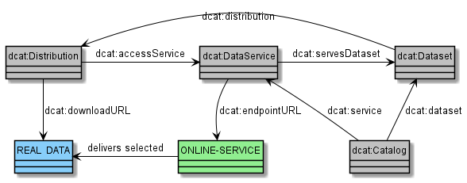

# Weitere Konventionen

## Angaben zum Herausgeber (`dct:publisher`) {#angaben-zum-herausgeber}

<figure id="konvention-36" class="konvention"><figcaption>
Unter `dct:publisher` MUSS die Organisation eingetragen werden, die den Datensatz (im rechtlichen, nicht technischen Sinne) veröffentlicht, d.h. die entschieden hat, dass Dritten Nutzungsrechte (hilfsweise Zugang) eingeräumt werden.
</figcaption></figure>

### Art des Herausgebers

Bei Angaben zum Herausgeber KANN dieser mit der Eigenschaft `dct:type` einem konkreten Typ zugeordnet werden. Dabei MUSS das [ADMS-Vokabular](http://purl.org/adms/publishertype/1.0) verwendet werden. Es kommt eine Untermenge der in DCAT-AP möglichen Werte zum Einsatz.

| ADMS PURL-URI                                                      | deutsche Entsprechung (Beispiel)                                      | unterstützt in DCAT-AP.de |
| :----------------------------------------------------------------- | --------------------------------------------------------------------- | :-----------------------: |
| http://purl.org/adms/publishertype/Academia-ScientificOrganisation |                                                                       |             -             |
| http://purl.org/adms/publishertype/Company                         | Firma, Unternehmen (z.B. Siemens)                                     |             -             |
| http://purl.org/adms/publishertype/IndustryConsortium              | Industriekonsortium                                                   |             -             |
| http://purl.org/adms/publishertype/LocalAuthority                  | kommunale Ebene (z.B. Stadt Köln, Landkreise, Kommunalverbände, etc.) |             x             |
| http://purl.org/adms/publishertype/NationalAuthority               | Bundesebene (z.B. Bundesanstalt für Landwirtschaft und Ernährung)     |             x             |
| http://purl.org/adms/publishertype/NonGovernmentalOrganisation     |                                                                       |             -             |
| http://purl.org/adms/publishertype/NonProfitOrganisation           |                                                                       |             -             |
| http://purl.org/adms/publishertype/PrivateIndividual(s)            | Privatperson(en)                                                      |             -             |
| http://purl.org/adms/publishertype/RegionalAuthority               | Landesebene (z.B. NRW)                                                |             x             |
| http://purl.org/adms/publishertype/StandardisationBody             |                                                                       |             -             |
| http://purl.org/adms/publishertype/SupraNationalAuthority          | EU-Agenturen, UN-Agenturen, (z.B. EPO oder Worldbank)                 |             x             |

Die in ADMS vorgesehene Unterscheidung zwischen Forschung und Industrie, Standardisierungsgremien und Nicht-Regierungsorganisationen, Privatpersonen und Firmen, welche sich aus dem historischen Anwendungskontext von ADMS erklärt, wird nicht unterstützt, da diese für die deutsche Zielgruppe von DCAT-AP.de nicht trennscharf abzugrenzen sind.

Mit der für DCAT-AP.de erfolgten Auswahl wird versucht, mit „local“, „regional“ „national“ und „supranational“ die vertikale Verwaltungsstruktur in Deutschland abzubilden. Diese Angaben beziehen sich auf die Einordung des Herausgebers, nicht zwangsläufig auf die Abdeckung des Datensatzes.

<figure id="konvention-37" class="konvention"><figcaption>
Es KÖNNEN Angaben zur Art eines Herausgebers gemacht werden, dabei MUSS die hier definierte Teilmenge des `adms:publishertype` Vokabulars verwendet werden.
</figcaption></figure>

<aside class="example html" data-format="text" title="Angabe der Art des Herausgebers">

```
<https://example.com/dataset/d4ce4e6e-ab89-44cb-bf5c-33a162c234de#dataset>
  a dcat:Dataset ;
  dct:title "Besuchsstatistiken für GovData" ;
  # ...
  dct:publisher <https://www.govdata.de/web/guest/impressum#publisher> .

<https://www.govdata.de/web/guest/impressum#publisher>
  a foaf:Organization ;
  foaf:name "Geschäfts- und Koordinierungsstelle GovData" ;
  dct:type <http://purl.org/adms/publishertype/NationalAuthority> .
```

</aside>


## Weitere wichtige Rollen {#weitere-wichtige-rollen}

Die Eigenschaft `dct:publisher` ist für Datensätze auf maximal einen Eintrag beschränkt. Zur Realisierung eines erweiterten Rollenkonzeptes wurde dem Vorschlag der DCAT-AP Spezifikation gefolgt und es wurden weitere Rollen:

Dazu werden
- zum bestehenden `dct:publisher` weitere `dcterms`-Eigenschaften ergänzt: `dct:contributor` und `dct:creator`,
- weitere Eigenschaften im DCAT-AP.de übergangsweise eingeführt, bis der Bedarf an Ausdrucksmöglichkeiten für Rollen durch DCAT-AP oder DCAT in Folgeversionen gelöst ist: `dcatde:originator` und `dcatde:maintainer`.

Einen Datensatz KÖNNEN neben dem Herausgeber (erfasst in `foaf:Agent`) weitere Stellen als Beteiligte und diese zu einem konkreten Typ zugeordnet werden. Dabei MUSS das ADMS-Vokabular verwendet werden. 


| Rollen-Name     | Definition                                                                                                              | URI der Eigenschaft | Verwendete Klasse                    |
| --------------- | ----------------------------------------------------------------------------------------------------------------------- | :------------------ | :----------------------------------- |
| Kontakt         | Stellen oder Personen, die kontaktiert werden können, um sich über die Daten zu informieren oder sie zu erwerben.       | `dcat:contactPoint` | `vCard:Kind`                         |
| Autor           | Stellen oder Personen, die die Daten erstellt haben.                                                                    | `dct:creator`       | `foaf:Agent`                         |
| Bearbeiter      | Stellen oder Personen, die die Daten bearbeitet haben.                                                                  | `dct:contributor`   | `foaf:Agent`                         |
| Herausgeber     | Stellen oder Personen, die über die Einräumung von Zugang und Nutzungsrechten für Dritte entschieden haben.             | `dct:publisher`     | `foaf:Agent`                         |
| Urheber         | Personen, die Urheberrechte an den Daten besitzen                                                                       | `dcatde:originator` | `foaf:Agent`, genauer: `foaf:Person` |
| Verwalter       | Stellen oder Personen, die Verantwortung und Rechenschaftspflicht für die Daten und ihre angemessene Pflege übernehmen. | `dcatde:maintainer` | `foaf:Agent`                         |


Das folgende fiktive Beispiel veranschaulicht den Gebrauch von verschiedenen Rollen in DCAT-AP.de:
<aside class="example" title="Beispiel zur Veranschaulichung verschiedener Rollen">
Das Bundesministerium für Familie, Senioren, Frauen und Jugend (BMFSFJ) gibt eine sozio-ökonomische Studie zu den Lebensverhältnissen Minderjähriger in Deutschland in Auftrag. Das BMFSFJ wird durch die Beauftragung zum Herausgeber (`dct:publisher`) und Rechteträger der Untersuchung auf Basis des gewählten Vertragsverhältnisses.

Mit der Durchführung der Studie wird die Gesellschaft für Konsumforschung (GFK) betraut. Somit ist die GFK der Autor (`dct:creator`) dieser Untersuchung aber nicht der Rechteinhaber der Studie. Die Rechte verbleiben durch das gewählte Vertragsverhältnis beim BMFSFJ. Die Studie gibt die GFK-Mitarbeiter Dieter Hinz und Rüdiger Schein namentlich als Urheber (`dcatde:originator`) an.

Nachdem die Studie durchgeführt wurde, wird innerhalb des BMFSFJ die Abteilung 5 für Kinder und Jugend mit der Verwaltung beauftragt, mit der Abteilungsleiterin Sabine Eilerts. Die Rechenschaftspflicht (`dcatde:maintainer`) der Untersuchung ist fortan an dieser Stelle.

In der Abteilung 5 wird mit der Bearbeitung der Studie die Unterabteilung 50 betraut (`dct:contributor`) unter der Leitung von Karl Weiß.

Als Ansprechpartner (`dcat:contactPoint`) werden die Kontaktdaten des Referats 501 „Chancengerechtigkeit, Integration, Jugendsozialarbeit" angegeben, z.B. für die Entgegennahme etwaiger Kommentare durch Brigitte Neu.
</aside>


## Modellierung eines Datenservices (`dcat:DataService`) {#modellierung-eines-datenservices}

Zur Unterscheidung von zwischen einer `dcat:Distribution` und eines `dcat:DataService` besagt die [DCAT-AP-Guideline](https://github.com/SEMICeu/DCAT-AP/blob/master/releases/2.1.0/usageguide-dataset-distribution-dataservice.md), dass
 - Distributionen spezifische Repräsentationen von Datensätzen sind. Der Nutzer erhält die Daten als Download über die `dcat:accessURL` oder `dcat:downloadURL`.
 - Alles, was nicht darauf abzielt, eine herunterladbare Repräsentation der Daten zur Verfügung zu stellen, ist ein Datenservice. Diese bieten smartere, interaktive Wege an, die gewünschten Daten zu beziehen.

Auch diese Abgrenzung lässt einen gewissen Spielraum.

<small>

<br>Zusammenhang zwischen Daten, Dataset, Distribution und Datenservice
</small>

Dieses Bild visualisiert, wie die einzelnen Klassen von DCAT (grau) untereinander in Beziehung stehen. Zusätzlich werden ihre Verbindungen zum eigentlichen Online-Service (grün) und den Fachdaten (blau). Es bietet viele unterschiedliche Modellierungsmöglichkeiten, die noch näher konkretisiert werden sollten. 
Beispiele, wie ein Dataservice modelliert werden kann, finden sich sowohl bei [GeoDCAT](https://semiceu.github.io/GeoDCAT-AP/releases/2.0.0/#examples-for-data-service) als auch bei [W3C-DCAT](https://www.w3.org/TR/vocab-dcat-2/#examples-data-service). DCAT-AP hat noch keine Best Practice identifiziert. GovData ist mit dem W3C und den DCAT-AP-Verantwortlichen im weiteren Austausch, um hier weitere Konkretisierungen zu erreichen. 

<figure id="konvention-41" class="konvention"><figcaption>
Distributionen die über eine `dcat:accessService` auf einen `dcat:DataService` verweisen, DÜRFEN über keine `dcat:downloadURL` verfügen und MÜSSEN in ihrer `dcat:accessURL` die `dcat:endpointURL` des `dcat:DataService` angeben.
</figcaption></figure>

Datenportale wie GovData sind derzeit stark auf Datensätze zentriert. Daher soll zunächst ein Beispiel gegeben werden für einen Datensatz, der *zusätzlich* über einen Datenservice verfügt:

<aside class="example html" data-format="text" title="Datensatz mit einem zusätzlichen Datenservice">

```
_:dataset-123 a dcat:Dataset ;
  dct:title "Kontaktdaten aller deutschen Polizeidienststellen" ;
  dct:description "Dieser Datensatz beinhaltet alle Polizeidienststellen in Deutschland. Er beinhaltet die Adressen, ihre Geo-Position und Telefonnummer. Da der Datensatz sehr groß ist, wird ebenfalls ein WebService zur Verfügung gestellt, der immer nur die Polizeidienststellen einer Postleitzahl zurück gibt." ;
  dcat:distribution _:distr-123-download ;
  dcat:distribution _:distr-123-dataservice ;
  adms:sample _:distr-123-example ;
  dcatde:politicalGeocoding <http://dcat-ap.de/def/politicalGeocoding/Level/federal> ;
  dct:spatial <http://publications.europa.eu/mdr/resource/authority/country/DEU> ;
.

_:distr-123-download a dcat:Distribution ;
  dcat:accessURL   <https://example.org/polizeidienststellen.xml> ;
  dcat:downloadURL <https://example.org/polizeidienststellen.xml> ;
  dct:title "Kontaktdaten aller deutschen Polizeidienststellen" ;
  dct:description "Diese Distribution beinhaltet die Kontaktdaten aller Polizeidienststelle in Deutschland zum Download. ACHTUNG: Die Datei ist sehr groß!" ;
  dcat:byteSize "2500000000"^^xsd:decimal ;
  dct:format <http://publications.europa.eu/resource/authority/file-type/XML> ;
.

_:distr-123-example a dcat:Distribution ;
  dcat:accessURL   <https://example.org/polizeidienststellen-example.json> ;
  dcat:downloadURL <https://example.org/polizeidienststellen-example.json> ;
  dct:title "Beispiel der Kontaktdaten aller deutschen Polizeidienststellen gemäß Datenservice" ;
  dct:description "Dieser Datensatz beinhaltet die Kontaktdaten aller Polizeidienststelle der Postleitzahl 13585 zum Download. Es handelt sich dabei um ein Beispiel, wie der Datenservice die Daten ausliefert. Anders als der Bulk-Download liegt dieses Beispiel, wie die Antworten des Datenservices, als JSON-Datei vor." ;
  dct:license <http://dcat-ap.de/def/licenses/dl-zero-de/2.0> ;
  dcat:byteSize "10000"^^xsd:decimal ;
  dct:format <http://publications.europa.eu/resource/authority/file-type/JSON> ;
.
_:distr-123-dataservice a dcat:Distribution ;
  dcat:accessURL <https://example.org/api/polizeidienststellen/> ;
  dct:accessService _:dataservice-123 ;
  dct:title "Distribution die zum Datenservice für die Kontaktdaten aller deutschen Polizeidienststellen gehört" ;
  dct:license <http://dcat-ap.de/def/licenses/dl-zero-de/2.0> ;
  dct:format <http://publications.europa.eu/resource/authority/file-type/JSON> ;
.

_:dataservice-123 a dcat:DataService ;
  dct:title "Datenservice für die Kontaktdaten aller deutschen Polizeidienststellen" ;
  dct:license <http://dcat-ap.de/def/licenses/dl-zero-de/2.0> ;
  dcat:endpointURL <https://example.org/api/polizeidienststellen/> ;
  dcat:endpointDescription <https://example.org/api/polizeidienststellen/wfs?service=WFS&request=getcapabilities> ;
  dcatap:availability <http://publications.europa.eu/resource/authority/planned-availability/STABLE> ;
  dcat:servesDataset _:dataset-123 ;
.
```

</aside>

Ein weiteres, extremes, Beispiel sind Datenservices, die über keine Distributionen und Datensätze verfügen, da sie z.B. lediglich Werte umrechnen oder Abstände zwischen zwei Orten berechnen.

<aside class="ednote">
Ein Beispiel bzw. eine Best-Practices soll für die nächste Version zusammen mit den Stakeholdern und nach Möglichkeit mit DCAT-AP entwickelt werden.
</aside>

## Formatierung von Beschreibungen (`dct:description`)

GovData erwartetet in allen Text-Elementen, also insbesondere in der Eigenschaft `dct:description`, weitestgehend unformatierten Text. Zusätzlich werden vom Portal folgende HTML-Tags intreptiert: `<a></a>`, `<li></li>`, `<ol></ol>`, `<ul></ul>`, `<p></p>`, `<br>`, `<b></b>`, `<i></i>` und `<u></u>`.

Weitere HTML-Tags oder Markdown-Kennzeichnungen, werden ignoriert. Zeichen die verwendet wurden, um den Text mit Markdown zu formatieren, werden normal angezeigt. Dies reduziert die Lesbarkeit der Texte.

Ohne die Spezifikation umfangreich anzupassen, sind keine Wege bekannt, in RDF-Daten anzugeben, dass ein String mit Markdown formatiert wurde.
Wollen andere Portale, die DCAT-AP.de nutzen, Auszeichnungssprachen wie Markdown in Beschreibungen nutzen, müssen sie dies von den Datenbereitstellern fordern oder die Verwendung technisch erkennen können.
