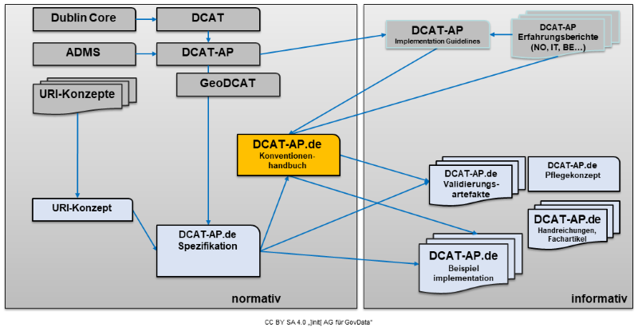

In Deutschland findet zwischen GovData als zentralem Datenportal einerseits und Datenbereitstellern (z.B. Datenportalen der Bundesländer oder Kommunen) andererseits ein Datenaustausch statt.

Die Fachgruppe GovData hat am 21. November 2016 beschlossen, dass dem Datenaustausch zwischen dem Datenportal GovData und anderen Datenportalen eine deutsche Ableitung des europäischen Metadatenstandards DCAT-AP zugrunde gelegt werden soll. DCAT-AP.de ist die spezifische nationale Anpassung des Application Profiles „DCAT-AP v2.0“ und dient zukünftig als bundesweit einheitlicher Metadatenstandard zum Austausch von Metadaten zu öffentlichen Verwaltungsdaten in Deutschland.

Seit Anfang 2019 werden Metadaten nur noch im Standard DCAT-AP.de entgegengenommen.

Für alle Datenbereitstellenden, die direkt an das GovData-Portal anliefern, wurde von der Fachgruppe GovData für den Wechsel auf DCAT-AP.de 2.0 ein Übergangszeitraum von 9 Montaten nach der Veröffentlichung des Standards. Spätestens dann müssen die Metadaten in der DCAT-AP.de Version 2.0  bereitgestellt werden.

Dieses Konventionenhandbuch erläutert die Ergänzungen, die die DCAT-AP.de Spezifikation gegenüber DCAT-AP vornimmt.

<small>

Konventionenhandbuch als normatives Regelungsdokument
</small>

Ergänzende Regeln adressieren weitere Harmonisierungsbedarfe, die nicht in die allgemeinen Normen der DCAT-AP.de Spezifikation eingegangen sind, weil sie entweder nur für den Austausch mit GovData gedacht sind (für den Austausch zwischen Landes- und Kommunalportalen aber z.B. anders geregelt sein können) oder absehbar einem kürzeren Releasezyklus unterliegen als die Spezifikation. Das Konventionenhandbuch richtet sich an Entwicklungsdienstleister des GovData Portals sowie Datenbereitsteller von Open Data Portalen in Deutschland bzw. Verantwortliche für die Softwareentwicklung dieser Portale. 

Für die Nutzung von DCAT-AP.de in anderen Einsatzbereichen können eigene Konventionen vereinbart werden.

Die Begriffe MUSS, SOLL und KANN werden in diesem Dokument entsprechend ihren in [RFC2119](https://www.rfc-editor.org/rfc/rfc2119) definierten Bedeutungen verwendet, wenn und nur wenn sie wie hier gezeigt durchgehend groß geschrieben wurden. 

Neben den explizit als nicht-normativ gekennzeichneten Abschnitten sind auch alle Diagramme, Beispiele und Hinweise in diesem Dokument nicht normativ. Alle anderen Angaben sind normativ.
