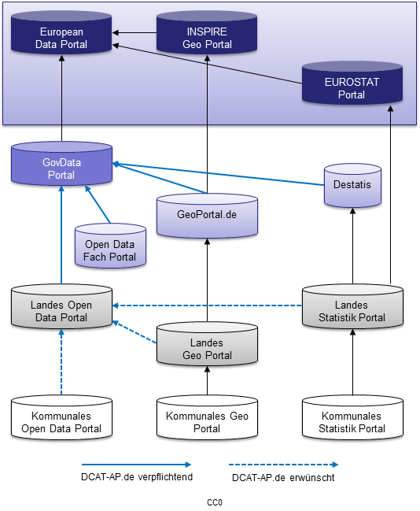
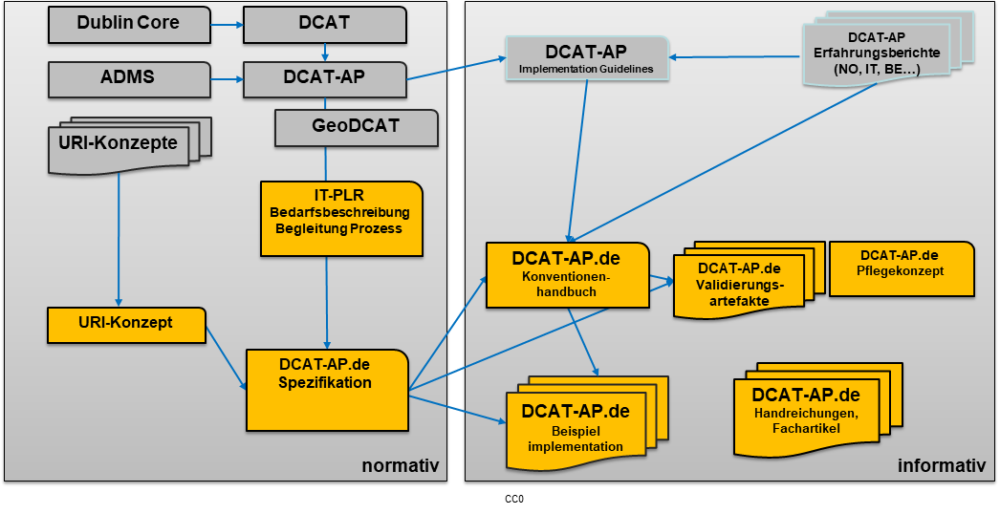
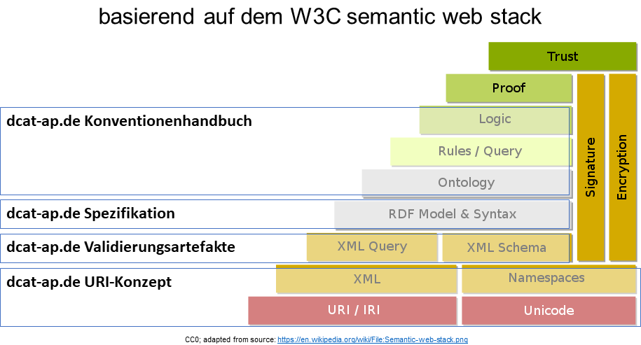

# Einführung {#einfuhrung}

Diese Spezifikation trifft semantische Regelungen für die Kommunikation von und zum GovData-Portal sowie für die Kommunikation mit dem europäischen Datenportal und im GovData-Portalverbund.
Sie ist neben dem [URI-Konzept für DCAT-AP.de](#dcat-apde-uri-konzept) und dem [DCAT-AP.de-Konventionenhandbuch](#dcat-apde-konventionenhandbuch) einer von drei Bausteinen, der Vorgaben zum Austausch von Metadaten im GovData-Portalverbund enthält.

Das deutsche Schema DCAT-AP.de übernimmt die Regeln des europäischen Metadatenaustauschschemas DCAT-AP mit zusätzlichen Einschränkungen und Erweiterungen.
DCAT-AP wiederum basiert auf der [„Data Catalog Vocabulary“ (DCAT) Spezifikation](https://www.w3.org/TR/vocab-dcat-2/), welche von der [Dataset Exchange Working Group](https://www.w3.org/2017/dxwg/) weiterentwickelt wird.
DCAT ist ein RDF-Vokabular mit dem Ziel, die Interoperabilität zwischen Online-Datenkatalogen zu verbessern. Die Spezifikation „Data Catalog Vocabulary“ (DCAT) wurde am 16. Januar 2014 vom W3C als „W3C Recommendation“ veröffentlicht und liegt inzwischen in der Version 3.0 vor.
In DCAT werden Klassen und Eigenschaften weiterer etablierter Vokabulare (ADMS, FOAF) wiederverwendet. DCAT setzt auf ein bewährtes Set aus gemeinsamen Metadaten namens „Dublin Core“ auf, welches im Jahr 2009 als ISO 15836 Standard veröffentlicht wurde.

## Standardisierungsbedarf

Die vorliegende Spezifikation ist eine weitere standardkonforme und daher kompatible Anpassung von DCAT und DCAT-AP für den deutschen Nutzungskontext (DCAT-AP.de).
Anlass und Zweck der Erstellung von DCAT-AP.de ist der Austausch von Metadaten offener Verwaltungsdaten für deutsche Open Data-Portale, deren Daten in GovData für Bundes-, Landes- und kommunale Ebene zentral bereitgestellt werden. Daher verantwortet das Produktmanagement GovData der FITKO die Fortschreibung des Standards DCAT-AP.de.

<figure id="img-standardisierungsbedarf-metadatenfoderation-govdata">
  
  <figcaption>Standardisierungsbedarf der Metadatenföderation GovData</figcaption>
</figure>

### Bedarfsbeschreibung „Metadatenstruktur für offene Verwaltungsdaten“

Grundlage für die Erstellung dieser Spezifikation ist der Beschluss der Fachgruppe GovData vom 21. November 2016, eine standardkonforme deutsche Ableitung von DCAT-AP als Metadatenstandard zu vereinbaren.
DCAT-AP.de wurde als Lösung des 2013 angemeldeten und 2017 formalisiert beschriebenen Standardisierungsbedarfs „Metadatenstruktur zum Austausch von Metadaten über offene Verwaltungsdaten“ im Jahr 2018 beim IT-Planungsrat eingereicht. DCAT-AP.de fungiert nach dem Beschluss des IT-Planungsrates vom 28.06.2018 seit 2019 als gemeinsame verbindliche Grundlage für den Metadatenaustausch zwischen deutschen Open Data-Portalen. Die vorliegende Version 3.0 wurde von der Fachgruppe GovData beschlossen.
DCAT-AP und damit die deutsche Ableitung DCAT-AP.de ist ein RDF-Vokabular.

> Das **Resource Description Framework** (RDF, engl. sinngemäß „System zur Beschreibung von Ressourcen“) bezeichnet eine technische abgestimmte Gruppe von Spezifikationen, die vom [World Wide Web Consortium](https://de.wikipedia.org/wiki/World_Wide_Web_Consortium) (W3C) als Standard zur Beschreibung von [Metadaten](https://de.wikipedia.org/wiki/Metadaten) entwickelt wurde. Mittlerweile gilt RDF als ein grundlegender Baustein des [Semantischen Webs](https://de.wikipedia.org/wiki/Semantic_Web). 
> 
> Informationen werden als eine Sammlung von Aussagen über Ressourcen (Dinge) modelliert. Im RDF-Modell besteht jede [Aussage](https://de.wikipedia.org/wiki/Elementarsatz) aus den drei Einheiten Subjekt, Prädikat und Objekt, wobei ein Prädikat Eigenschaften oder Aspekte einer Ressource bezeichnet. Die Ausprägung dieser Eigenschaft wird entweder durch eine andere Ressource oder lediglich einen Wert (Literal) als Objekt näher beschrieben. Zusammen bilden diese drei Einheiten ein Tripel („3-Tupel“). 
> 
> Um global eindeutige Bezeichner für Ressourcen zu haben, werden diese dafür nach Konventionen analog zu [URL](https://de.wikipedia.org/wiki/Uniform_Resource_Locator) geformt, und durch Bezug auf Namensräume (namespaces) eindeutig bezeichnet.
> 
> Quelle: Adaptiert vom [Wikipediaartikel](https://de.wikipedia.org/wiki/Resource_Description_Framework) zu RDF am 13.04.2017

## Weitere Dokumente des DCAT-AP.de Standards

Neben dieser Spezifikation machen weitere Bausteine Vorgaben auf organisatorischer, technischer und semantischer Ebene für den Austausch im GovData-Portalverbund: Das [URI-Konzept](#dcat-ap-de-uri-konzept), das [Konventionenhandbuch](#dcat-ap-de-konventionenhandbuch)  bzw. [Guidelines](#dcat-ap-de-guidelines) und [Validierungsartefakte](#dcat-ap-de-validierungsartefakte).

<figure id="standardisierungsrahmen-dcat-ap-de">
  
  <figcaption>Standardisierungsrahmen DCAT-AP.de</figcaption>
</figure>

Die verschiedenen Dokumente des Standards addressieren dabei verschiedene Ebenen des „W3C semantic web stacks“:

<figure id="dcat-ap-de-im-semantic-web-stack">
  
  <figcaption>DCAT-AP.de Dokumente und der W3C semantic web stack</figcaption>
</figure>

### DCAT-AP.de URI-Konzept {#dcat-apde-uri-konzept}

Das DCAT-AP.de URI-Konzept schränkt den Gestaltungsspielraum der Kommunikationspartner hinsichtlich der Namensgebung von URIs ein und bietet URIs im Namensraum „DCAT-AP.de und GovData.de“ an, um Verweise auf Vokabulare zu ermöglichen, die über die durch DCAT und DCAT-AP bereitgestellten Verweise hinausgehen.

Das URI-Konzept kann derzeit nur als [PDF-Download](https://www.dcat-ap.de/def/uriConcept/1.0) bezogen werden.

### DCAT-AP.de Konventionenhandbuch {#dcat-apde-konventionenhandbuch}

Das  Konventionenhandbuch ist in der Version 2.0 als [Web-Version](https://www.dcat-ap.de/def/dcatde/2.0/implRules/) verfügbar. Es wird keine geschlossene Aktualisierung auf Version 3.0 geben. Stattdessen werden die Konventionen
 - in die Spezifikation aufgenommen,
 - in eine Guideline überführt oder
 - gestrichen.

Beispiele für Konventionen, die in die Spezifikation aufgenommen wurden, sind die aufgenommenen Eigenschaften in der Klasse `vcard:Kind` oder dass die Angabe einer Lizenz für Distributionen nun verpflichtend ist.

Da aktuell noch keine Guidelines existieren, soll an dieser Stelle explizit darauf hingewiesen werden, dass folgende Konventionen weiterhin Bestand haben:
 - [12: Datenbereitsteller ID](https://www.dcat-ap.de/def/dcatde/2.0/implRules/#konvention-12)
 - [13: Dubletten: Föderationsweite ID](https://www.dcat-ap.de/def/dcatde/2.0/implRules/#konvention-13)
 - [25: Dubletten: Identifier](https://www.dcat-ap.de/def/dcatde/2.0/implRules/#konvention-25)
 - [26: Dubletten: Eigene Identifier](https://www.dcat-ap.de/def/dcatde/2.0/implRules/#konvention-26)
 - [40: Dubletten: Aktualitätsdatum](https://www.dcat-ap.de/def/dcatde/2.0/implRules/#konvention402)

Auch nicht genannte Konventionen und Inhalte des Konventionenhandbuchs bleiben als Empfehlung bestehen, so lange sie nicht durch eine neue Guideline/Best Practice überholt werden.

  Für GovData wurde zur weiteren Steigerung der Interoperabilität das DCAT-AP.de-Konventionenhandbuch erstellt, welches die Kommunikation mit GovData durch Regeln weiter vereinheitlicht. Hier sind z.B. Regelungen sowie zusätzliche Wertelisten und URIs definiert, die für die Anlieferung von Metadaten an das GovData Portal gelten. Diese wurden aus der DCAT-AP.de-Spezifikation herausgelöst, welche zugunsten der Kompatibilität mit DCAT-AP Datentypen mit größerem Freiheitsgrad vorsieht. Dort wo DCAT-AP bewusst Freiräume lässt, um unterschiedliche Verfahrensweisen in den europäischen Staaten zu berücksichtigen, wird – sofern möglich – für den Austausch von offenen Verwaltungsdaten in  Deutschland eine verbindliche Handhabung vereinbart.

### DCAT-AP.de Guidelines {#dcat-apde-guidelines}

GovData wird in der Zukunft Best Practices und Guidelines veröffentlichen, die das bisherige Konventionenhandbuch ersetzen. Sie werden hier dann verlinkt.

### DCAT-AP.de Validierungsartefakte {#dcat-apde-validierungsartefakte}

GovData stellt Validierungsartefakte in der Form von SHACL-Regeln und einem Online-Validator zur Verfügung. Aktuell liegen nur SHACL-Regeln für DCAT-AP.de 2.0 vor, ihre Überarbeitung wird voraussichtlich noch in Q4 2024 erfolgen.

- [SHACL-Regeln im DCAT-AP.de OpenCode-Repository](https://gitlab.opencode.de/fitko/govdata/dcat-ap.de/-/tree/master/Releases/DCAT-AP.de%20V2.0/)
- [Validator](https://www.itb.ec.europa.eu/shacl/dcat-ap.de/upload) 
- [GitHub-Repository des Validators](https://github.com/GovDataOfficial/DCAT-AP.de-SHACL-Validation/)
- [Gespiegeltes OpenCode-Repository des Validators](https://gitlab.opencode.de/fitko/govdata/dcat-ap.de-shacl-validation)