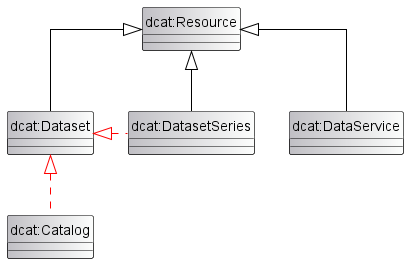
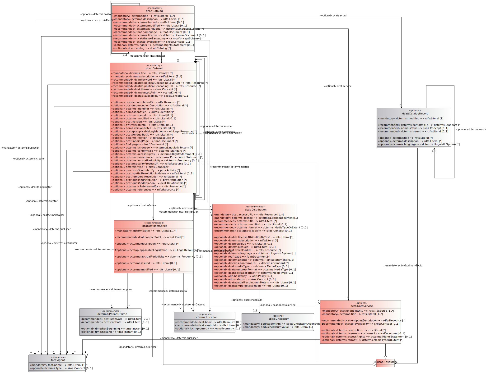

# Überblick über das DCAT-AP.de Modell {#ueberblick-datenmodell}

Als Austauschstandard für allgemeine offene Verwaltungsdaten ist der Hauptanwendungsfall von DCAT-AP.de der Austausch von Metadaten zwischen Datenportalen. Dabei wird in der Regel ein Katalog (`dcat:Catalog`) bereitstellt, der Datensätze (`dcat:Dataset`), Datenservices (`dcat:DataService`) und/oder Datensatzserien (`dcat:DatasetSeries`) beinhaltet. Die Zugang zu den eigentlichen Daten wird zudem in Distributionen (`dcat:Distribution`) beschrieben, die daher auch eine zentrale Bedeutung haben. Diese fünf Klassen (und die Superklasse `dcat:Resource` werden im [UML-Diagramm](#uml-diagramm) rot hervorgehoben.)

Darüber hinaus beschreiben wir nur solche Klassen, die (im W3C-DCAT oder DCAT-AP) über mindestens eine Eigenschaft verfügen und zudem in DCAT-AP.de nicht durch ein kontrolliertes Vokabular abgedeckt werden. Daraus ergibt sich folgende Klassenübersicht:

| Hauptklassen                             |                                                          | Unterstützungsklassen            |
| ---------------------------------------- | -------------------------------------------------------- | -------------------------------- |
| [Ressource](#klasse-ressource)           | [Distribution](#klasse-distribution)                     | [Zeitraum](#klasse-zeitraum)     |
| [Katalog](#klasse-katalog)               | [Katalogeintrag](#klasse-katalogeintrag)                 | [Standort](#klasse-standort)     |
| [Datensatz](#klasse-datensatz)           | [Rollenzuordnung](#klasse-rollenzuordnung)               | [Identifier](#klasse-identifier) |
| [Datenservice](#klasse-datenservice)     | [Kontaktinformationen](#klasse-kontaktinformationen)     | [Prüfsumme](#klasse-prufsumme)   |
| [Datensatzserie](#klasse-datensatzserie) | [Verantwortliche Stelle](#klasse-verantwortliche-stelle) | [Beziehung](#klasse-beziehung)   |

## Sub- und Super-Klassen

Die Klasse [`dcat:Resource`](#klasse-ressource) wurde in der Version 2.0 von DCAT eingeführt. Sie ist die Super-Klasse von [`dcat:Dataset`](#klasse-datensatz), [`dcat:DatasetSeries`](#klasse-datensatzserie) und [`dcat:DataService`](#klasse-datenservice), was durch die schwarzen Pfeile symbolisiert wird.

<figure id="img-sub-sup-klassen">
  
  <figcaption>Sup- und Super-Klassenbeziehung in DCAT-AP.de</figcaption>
</figure>

Die roten, gestrichelten Pfeile zeigen, dass der `dcat:Catalog` und die `dcat:DatasetSeries` gemäß des W3C-DCAT auch Sub-Klassen vom `dcat:Dataset` sind. Diese Beziehung wird in DCAT-AP nicht weiter hervorgehoben, aber in DCAT-AP.de berücksichtigt.

Auch wenn im Zusammenhang von RDF grundsätzlich nicht von "Vererbung" gesprochen wird, geht DCAT-AP.de davon aus, dass jede Eigenschaft einer Klasse auch sinnvoll mit der Sub-Klasse verwendet werden kann. Auf diese "Nachnutzbarkeit" der Eigenschaften ihrer Super-Klassen wird in der jeweiligen Klassenbeschreibung gesondert hingewiesen.

## Diagramm

<figure id="img-diagramm">
  
  <figcaption>Diagramm aller DCAT-AP-Klassen einschließlich der DCAT-AP.de Erweiterungen</figcaption>
</figure>