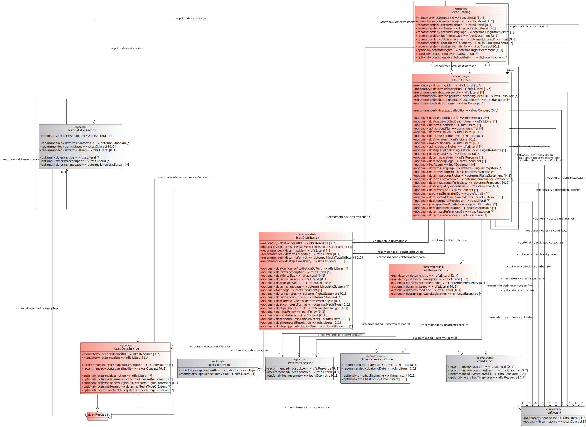

# Überblick über das DCAT-AP.de Modell

In diesem Abschnitt findet sich eine Übersicht über die Verbindlichkeit der Klassen von DCAT-AP.de.  
Als Austauschstandard für allgemeine offene Verwaltungsdaten ist der Hauptanwendungsfall von DCAT-AP.de der Austausch von Metadaten zwischen Datenportalen. Wie im UML Diagramm unter 3.1 dargestellt, gibt es dabei Klassen, die aufgrund Ihrer Bedeutung als zentrale fachliche Konzepte hervorgehoben sind.  
Beim Austausch von Metadaten wird in der Regel ein Katalog (dcat:Catalog) bereitstellt, der mehrere Datensätze (dcat:Dataset) beinhaltet. Die Datensätze wiederum beinhalten Distributionen(dcat:Distribution) und Datenservices (dcat:DataService), die den Zugang zu den eigentlichen Daten herstellen.   

| Verpflichtend                                            | Empfohlene                                   | Optional                                   |                            |
| -------------------------------------------------------- | -------------------------------------------- | ------------------------------------------ | -------------------------- |
| [Katalog](#klasse-katalog)                               | [Distribution](#klasse-distribution)         | [Datenservice](#klasse-datenservice)       | [Verantwortliche Stelle](#klasse-verantwortliche-stelle) |
| [Datensatz](#klasse-datensatz)                           | [Kategorie](#klasse-kategorie)               | [Katalogeintrag](#klasse-katalogeintrag)   | Medientyp                  |
| [Verantwortliche Stelle](#klasse-verantwortliche-stelle) | [Kategorienschema](#klasse-kategorienschema) | [Standort](#klasse-standort)               | Standard                   |
| Ressource (RDFS)                                         | [Lizenzdokument](#klasse-lizenzdokument)     | [Identifier](#klasse-identifier)           | Dokument                   |
| Literal (RDFS)                                           |                                              | [Prüfsumme](#klasse-prufsumme)             | Rechtliche Aussage         |
|                                                          |                                              | [Zeitraum](#klasse-zeitraum)               | Provenienz                 |
|                                                          |                                              | [Rollenzuordnung](#klasse-rollenzuordnung) | Aktualisierungsfrequenz    |
|                                                          |                                              | [Rolle](#beziehung-rolle)                  | Linguistisches System      |

<aside class="ednote">

Mit der Einführung der `dcat:Resource` ist es eigentlich nicht mehr korrekt, den Datensatz als verpflichtende Klasse zu bezeichnen, da es Kataloge geben kann, die nur aus Datenservices bestehen.
Hierzu wird auf Ebene von DCAT-AP eine Lösung angestrebt und in der nächsten Version von DCAT-AP.de eingearbeitet.

</aside>

## UML-Diagramm

Das UML-Diagramm des DCAT-AP.de enthält alle Klassen, welche auch in DCAT-AP enthalten sind, inklusive ihrer DCAT-AP.de spezifischen Erweiterungen. 

<figure id="pic-id-5">
  
  <figcaption>UML-Diagramm aller DCAT-AP-Klassen einschließlich der DCAT-AP.de Erweiterungen</figcaption>
</figure>

| Legende |                             |
| ------- | --------------------------- |
| rot     | zentrale fachliche Konzepte |
| grau    | weitere fachliche Konzepte  |
